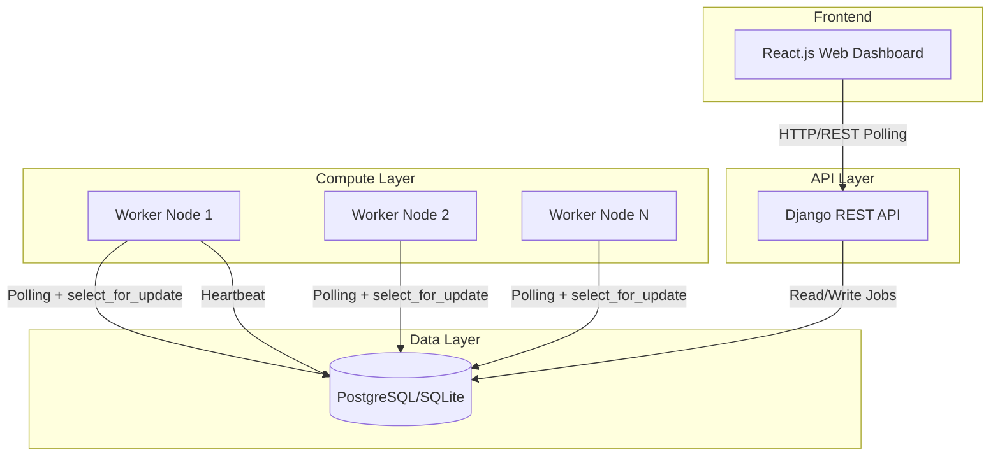
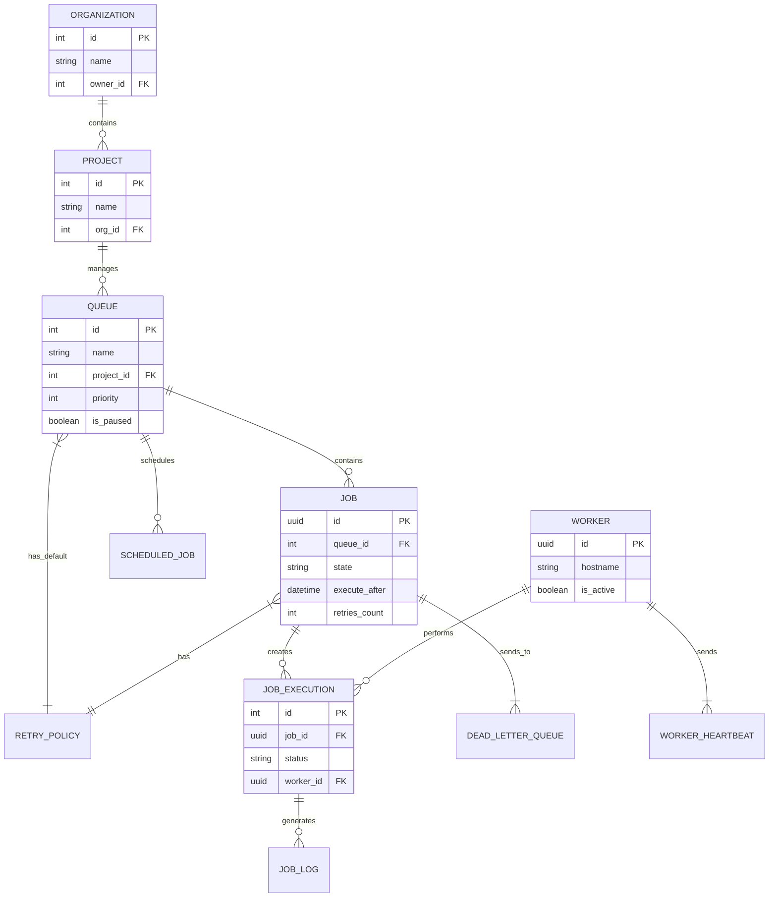

# Intern Assignment: Distributed Job Scheduler
**Final Submission Document**

---

## 1. System Architecture

The system follows a classic decoupled worker-queue model utilizing a monolithic backend API and standalone worker nodes, operating against a shared relational database. 



---

## 2. Entity-Relationship (ER) Diagram

The database schema is heavily normalized to support multi-tenancy, granular queue control, lifecycle execution logs, and scheduled jobs.



---

## 3. Design Decisions & Trade-offs

### Concurrency and Locking Strategy
**Decision:** We utilized Database Row-Level Locking (`SELECT ... FOR UPDATE SKIP LOCKED`) instead of an in-memory datastore like Redis or a message broker like RabbitMQ.
**Trade-off:** 
* *Pros:* Radically simplifies infrastructure requirements since no external broker is needed. The database becomes the single source of truth, ensuring absolute ACID compliance for job states. 
* *Cons:* Polling a relational database creates higher I/O overhead at extreme scale compared to Redis. However, by using index optimization and `SKIP LOCKED`, we prevent lock contention and enable safe distributed polling for thousands of concurrent workers.

### API Polling vs WebSockets
**Decision:** The React dashboard uses short-polling (`setInterval`) every 2 seconds rather than WebSockets.
**Trade-off:**
* *Pros:* Easier to implement, completely stateless, and avoids the complexity of configuring Daphne/ASGI servers and managing WebSocket connection drops.
* *Cons:* Slight latency in real-time updates and higher HTTP overhead.

### Retry Strategies
**Decision:** Implemented dynamic calculation for linear and exponential backoff dynamically at failure time, updating an `execute_after` timestamp.
**Trade-off:** Workers simply poll for jobs where `execute_after <= now()`, unifying immediate jobs and delayed retries into a single query path.

---

## 4. API Documentation

### `GET /api/queues/`
Retrieves a list of all queues, their state, and active statistics.
**Response:**
```json
{
  "queues": [
    {
      "id": 1,
      "name": "default",
      "priority": 1,
      "concurrency_limit": 10,
      "is_paused": false
    }
  ]
}
```

### `POST /api/jobs/`
Dispatches a new background job into a specified queue.
**Body:**
```json
{
  "name": "Process Video",
  "queue_id": 1,
  "payload": {"video_url": "https://..."}
}
```

### `POST /api/queues/<id>/toggle/`
Pauses or Resumes a specific queue. When paused, workers will automatically skip claiming jobs from this queue.

### `POST /api/jobs/<id>/retry/`
Manually forces a failed job back into the queue for re-execution, bypassing standard retry policy delays.

---

## 5. Setup & Execution Instructions

Ensure you have Python 3.x and Node.js installed.

1. **Install Dependencies:**
```bash
pip install django
npm install
```

2. **Database Migrations:**
```bash
python manage.py makemigrations core
python manage.py migrate
```

3. **Start the System:**
Open three separate terminals and run:
* `python manage.py runserver` (Starts API)
* `python manage.py runworker` (Starts Worker Node)
* `npm start` (Starts React UI)

4. **Run Automated Tests:**
```bash
python manage.py test
```
